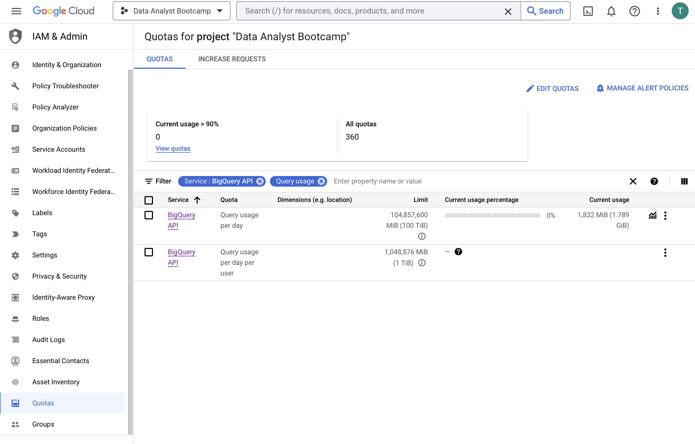

# BigQuery Tutorial

## Setup

### Add students

Go to [_"IAM & Admin"_](https://console.cloud.google.com/iam-admin/iam?authuser=2&project=da-bootcamp-2023) and choose _"GRANT ACCESS"_.

In the _"New principals"_ (!) field, type the e-mail address of the student you want to add (it must be a Google account so most probably Gmail).

In the _"Select a role"_ field, choose:

* `BigQuery User` (all standard BigQuery operations),
* `Service Usage Consumer` (allow to view their own quotas).

### Set up quotas

Go to [_"IAM & Admin"_](https://console.cloud.google.com/iam-admin/iam?authuser=2&project=da-bootcamp-2023) and then [_"Quotas"_](https://console.cloud.google.com/iam-admin/quotas?project=da-bootcamp-2023).

On this page, tick `Query usage per day` and `Query usage per day per user` and click on _"EDIT QUOTAS"_. You can then update the quotas and confirm your choice.

Note that:
* You cannot set a quota lower than 10 TiB per user per day.

* You cannot set a different quota for each user: it must be the same for all users in the project.

* Students can also see this page but they cannot modify their quota.

> The current costs are **$6.25 per TiB** (the first TiB per month is free but it looks like it is counted globally for the whole organization).
>
> More on this: https://cloud.google.com/bigquery/pricing#analysis_pricing_models
